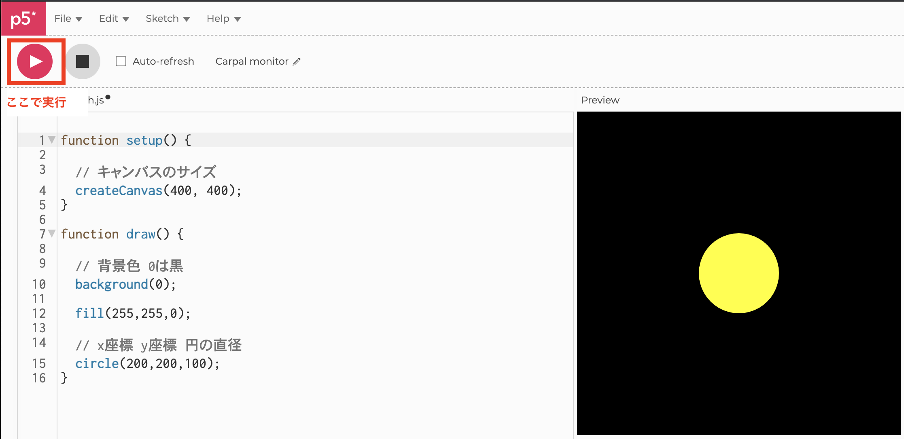
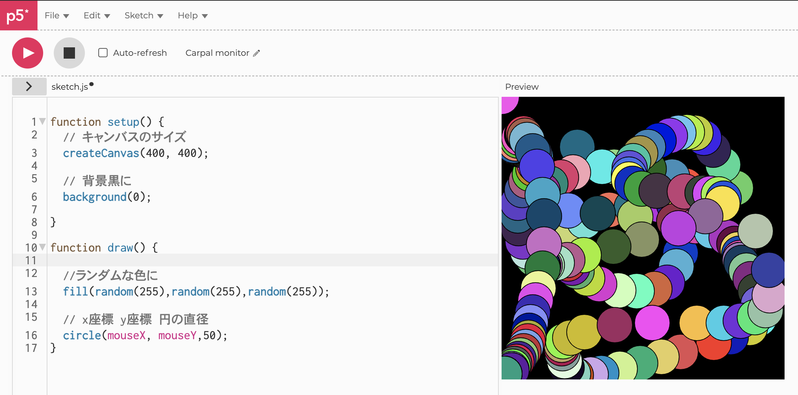
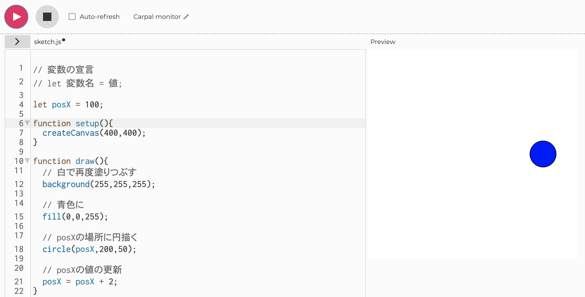
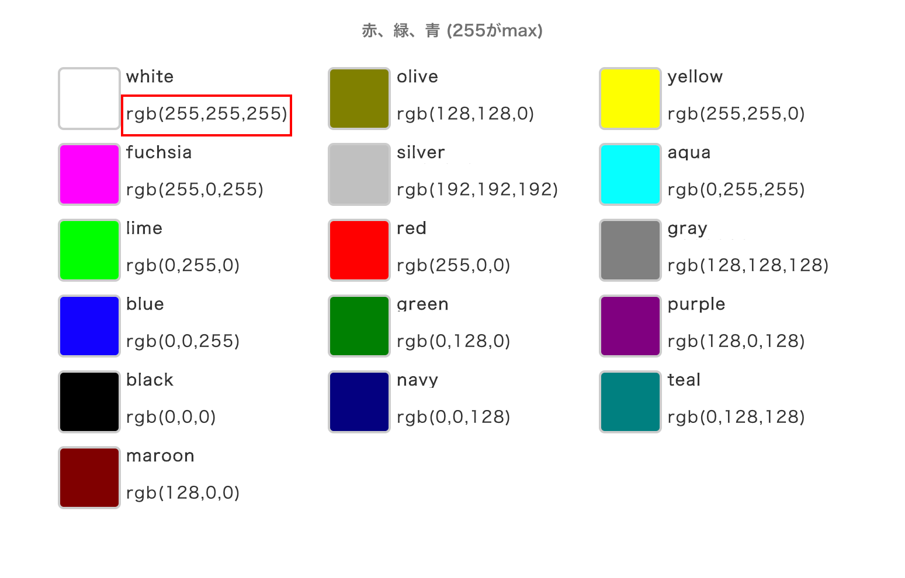

# p5.jsで初めてのプログラミング体験
エディターはこちら https://editor.p5js.org/
<br>
<br>

## まずは円を描いてみましょう。


```
function setup() {
  // キャンバスのサイズ
  createCanvas(400, 400);
}

function draw() {
  
  // 背景色 0は黒
  background(0);
  
  fill(255,255,0);
  
  // x座標 y座標 円の直径
  circle(200,200,100);
}
```
<br>
<br>

## マウスを使ったインタラクティブな表現



```
function setup() {
  // キャンバスのサイズ
  createCanvas(400, 400);
  
  // 背景黒に
  background(0);
  
}

function draw() {
  
  //ランダムな色に
  fill(random(255),random(255),random(255));
  
  // x座標 y座標 円の直径
  circle(mouseX, mouseY,50);
}
```

### setupとdrawについて
p5.jsでは、最初の一回だけ実行したい処理をsetup()内に、常時繰り返し実行したい処理をdraw()内に記述します。<br>
（サイズや背景設定などはsetup()内に、描画部分はdraw()に記述するのが流儀です。）<br>
drawは1秒間に60回実行されます。

<br>
<br>

## 変数を使ったアニメーション



```

// 変数の宣言
// let 変数名 = 値;

let posX = 100;

function setup(){
  createCanvas(400,400);
}

function draw(){
  // 白で再度塗りつぶす
  background(255,255,255);
  
  // 青色に
  fill(0,0,255);
  
  // posXの場所に円描く
  circle(posX,200,50);
  
  // posXの値の更新
  posX = posX + 2;
}

```

<br>
<br>

## アニメーションにif文を使ってみる

```

// 変数の宣言
// let 変数名 = 値;

let posX = 100;

function setup(){
  createCanvas(400,400);
  
}

function draw(){
  
  // 白で再度塗りつぶす
  background(255,255,255);
  
  // 青色に
  fill(0,0,255);
  
  // posXの場所に円描く
  circle(posX,200,50);
  
  // posXの値の更新
  posX = posX + 2;
  
  // posXの値が400を超えたら再度0に戻す
  if(posX > 400){
    posX = 0;
  }
  
}

```


### 色の指定方法
fill();のカッコの中に0~255の3つの数字を入れる。
<br>


```
例 

赤 fill(255,0,0);
緑 fill(0,255,0);
青 fill(0,0,255);

黄色fill(255,255,0);

```
